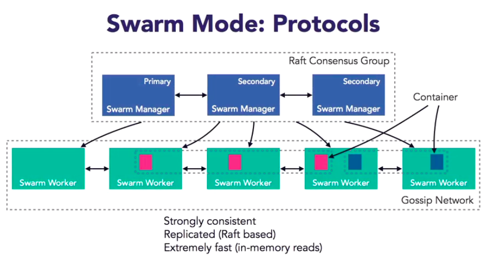

# Docker Swarm

Swarm Mode natively manages a cluster of Docker engines, this helps to avoid a single point of failure. Through Docker's CLI you can deploy to either a single host or a swarm of hosts. This Swarm Mode cluster can then be managed using the Docker CLI. Swarm Mode does need to be explicitly enabled.

* Declarative state model
* Self-organising and self-healing
* Service discovery
* Load balancing
* Scaling
* Rolling updates

## Swarm Mode Technical Overview

Swarm Managers manage Swarm Workers, an odd number of Swarm Managers is recommended. Swarm uses a Raft consensus algorythm to ensure all the Manager Nodes in charge of managing and scheduling taks in the cluster are in the same consistent state.

* Swarm Managers form a Raft Consensus Group
* Swarm Workers communciate using Gossip Network
* Communication is secure, with certificates created and issues automatically
  * Cryptographic node identity
  * Automatic encryption and mutual authentication (TLS)
  * Automatic cert (90 days; can be every 30 minutes)
  * Optionally an external CA can be used

## Using Docker Swarm

* Swarm help: `docker swarm`, `--help` is optional.
* `docker swarm init` - initialise a swarm, but what does this actually do?
* `docker swarm leave` - leaves the swarm, removes a node, what does this do?