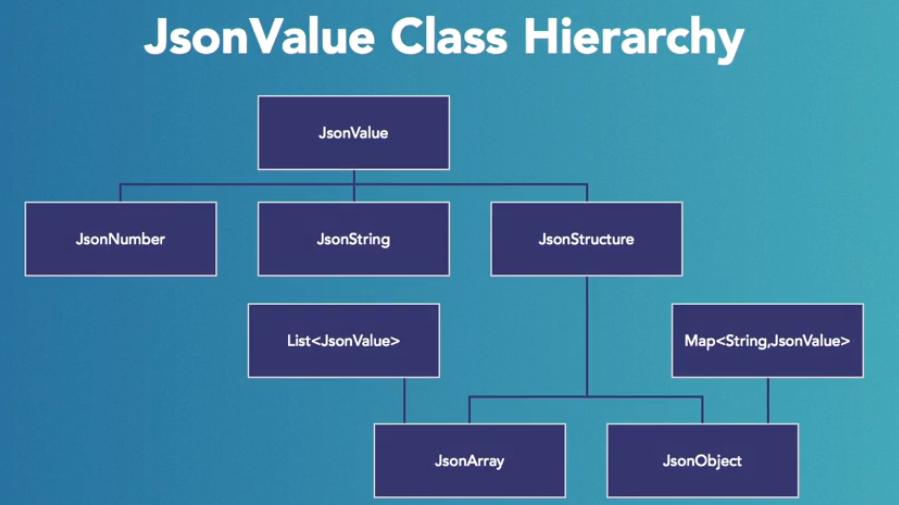

# Java EE JSON

Notes on Java EE's JSON APIs.

* [JWT - JSON Web Token](https://jwt.io/)
* NoSQL/document stores, store data as JSON documents. A JSON document is just another term for a JSON string.
  * NoSQL Datastores: Hadoop, Cassandra, MonetDB, CouchDB, etc.

## [JSON-P API](https://javaee.github.io/jsonp/)

Low-level, lightweight JSON parser and generator for manipulating JSON data at the property value level.

* JSR 353: Java API for JSON Processing
* Current version: 1.1
* Generate, parse, query, and transform JSON
* Two models - object and streaming
  * Object-oriented representation
  * Streaming model - more effecient model
* Memory-based model - loads the entire JSON document into memory

Consists of 3 packages:

* `javax.json`
  * Provides object model API
  * Models JSON data structure
  * Provides factories for parsers and writers
* `javax.json.streaming`
  * Provides streaming model API
  * Provides factories for parsers and writers
* `javax.json.spi`
  * Plugin implementations
  * For implementers and isn't necessary to know in order to use JSON.

### Object Model

Principle APIs:

* `JsonBuilder`
* `JsonReader`
* `JsonWriter`

JsonValue Class Hierarchy:



JsonValue types are immutable, so while the JsonObject and JsonArray objects support Map and List features respectively, they only support a subset of them. They also support new Java 8 features for Maps and Lists.

JsonValue types: `ARRAY`, `OBJECT`, `STRING`, `NUMBER`, `TRUE`, `FALSE`, `NULL`, accessinble via the `getValueType()` method.
For comparison in a unit test the types of JsonValue can be accessed like so: `JsonValue.ValueType.OBJECT` for Object, etc.

Loading a JSON Object from a String:

```Java
JsonReader jsonReader = Json.createReader(new StringReader(JSON));
JsonObject jsonObject = jsonReader.readObject();
jsonReader.close();
```

Loading a JSON Object from a file:

```Java
JsonReader jsonReader = Json.createReader(new FileReader(pathString));
JsonObject jsonObject = jsonReader.readObject();
jsonReader.close();
```

Creating a Model from Code:

```JSON
{
    "name": "Josh",
    "likes": [
        "Gingerbread",
        "Tea"
    ]
}
```

```Java
Json.createObjectBuilder()
        .add("name", "Josh")
        .add("likes", Json.createArrayBuilder()
                        .add("Gingerbread")
                        .add("Tea"))
        .build();
```

More complex object creation example from the Lynda.com JSON Processing course, with nested arrays, nested object, and nested objects within nested arrays:

```Java
JsonObject jsonObject = Json.createObjectBuilder()
    .add("title", "JSON-Processing With Java EE")
    .add("chapters", Json.createArrayBuilder()
                            .add("Introduction")
                            .add("1. JSON and Java")
                            .add("2. JSON-Processing API Features")
                            .add("3. The Java EE JSON Object Model")
                            .add("4. The Java EE JSON Streaming Model")
                            .add("Conclusion"))
    .add("release", true)
    .add("length", 60)
    .add("sourceCode", Json.createObjectBuilder()
                            .add("repositoryName", "JSON-Processing-with-Java-EE")
                            .add("url", "github.com/readlearncode"))
    .add("complementaryCourse", Json.createArrayBuilder()
                            .add(Json.createObjectBuilder()
                                    .add("title", "RESTful Service with JAX-RS 2.0")
                                    .add("length", 120))
                            .add(Json.createObjectBuilder()
                                    .add("titel", "Java Enterprise Edition Introduction")
                                    .add("length", 130)))
    .addNull("notes")
    .build();
```

Note: `build()` can be called on each array/object builder nested within the object being created, but it's only *necessary* to call it on the parent JSON object that's being created.

### Streaming Model

The streaming model reads JSON data one element at a time and fires an event each time it reaches one of the following elements:

* The start and end of an object
* The start and end of an array
* A key name
* Any string, number, Boolean, and NULL value

The parser stops at each event, it can then either process or discard it. It moves on to the next event until all elements in the JSON data stream have been parsed. This is a very effecient low-level API for passing large quantities of JSON data.

It has two principal interfaces, in the `javax.json.stream` package:

* JsonParser
* JsonGenerator

JSON events, e.g. `JsonParser.Event.START_OBJECT` (enums):

* `START_OBJECT`
* `END_OBJECT`
* `START_ARRAY`
* `END_ARRAY`
* `KEY_NAME`
* `VALUE_STRING`
* `VALUE_NUMBER`
* `VALUE_TRUE`
* `VALUE_FALSE`
* `VALUE_NULL`

## [JSON-B API](http://json-b.net/)