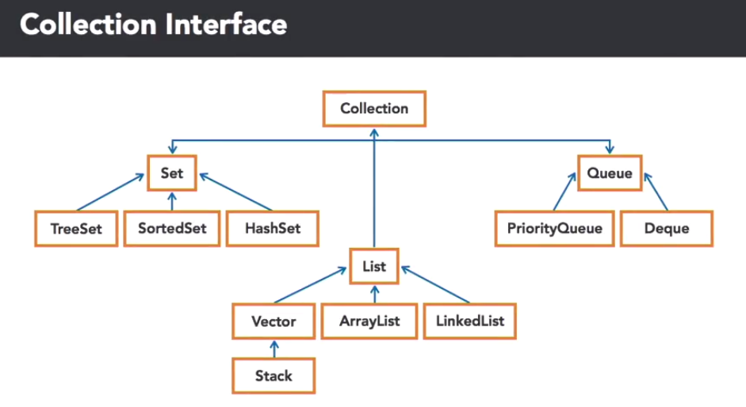

# Java: Data Structures

* A data structure is a way of collecting and organising data.
* Choosing the right data structure impacts efficiency.
* Data comes from many sources, such as databases and files.
* Many data structures are implemented as linked lists.

The structure beyond storing data provides operations for accessing and manipulating the data, and can be thought of as a container object that stores other objects or data primitives.

ArrayList and Vector Advantages:

* Provide fast access using indexing
* Memory coherence
* Provide an intial size (optional)
* Use interal arrays for storage, which makes random access fast.

## Collection Interface Hierarchy Diagram

